<div align="center">



### A reproducible RNA-Seq workflow that refuses to run an analysis it cannot support

Swap species, assay, or experimental design by editing configuration. No code changes, no per-project forks.

[](https://github.com/prem-p-singh/RNASeq-pipeline/actions/workflows/checks.yml)
[](LICENSE)
[](https://snakemake.readthedocs.io)
[](https://www.python.org)
[](https://bioconductor.org)

</div>

---

## 🧭 Where to look

| | Area | What lives there | Open |
|---|---|---|---|
| 🚦 | **Preflight** | Validates config, metadata and study design before any compute | [scripts/preflight.py](scripts/preflight.py) |
| 📐 | **Capability spec** | The assays, designs and backends this pipeline claims to support | [config/spec.yaml](config/spec.yaml) |
| ⚙️ | **Configuration** | Every knob, with the template doubling as the schema | [config/config.template.yaml](config/config.template.yaml) |
| 🧪 | **Self-checks** | Seven runnable checks, no test framework | [tests/](tests/) |
| 🧬 | **Worked example** | The grapevine study this was refactored from | [examples/grape/](examples/grape/) |
| 📖 | **Architecture** | Stages, decision gates, storage budget | [DESIGN.md](DESIGN.md) |

---

## 🔁 The path a dataset takes

<p align="center">
  <strong>🚦 Validate &nbsp;➜&nbsp; 📚 Reference &nbsp;➜&nbsp; 🔬 Quantify &nbsp;➜&nbsp; 🧹 Disposition &nbsp;➜&nbsp; 📊 Model &nbsp;➜&nbsp; 🎯 Evidence</strong>
</p>

The organising idea is that a result is only worth having when the design behind it was estimable, the samples that produced it are accounted for, and every stage that did not run says why.

<table>
<tr>
<td width="50%" valign="top">
<h3 align="center">🔬 Measurement</h3>
<p align="center">Reads to transcript abundance, with QC that distinguishes absent from zero.</p>
<p align="center">


</p>
</td>
<td width="50%" valign="top">
<h3 align="center">📊 Inference</h3>
<p align="center">Declarative contrasts, estimability enforced, per-contrast status recorded.</p>
<p align="center">


</p>
</td>
</tr>
<tr>
<td width="50%" valign="top">
<h3 align="center">🖥️ Execution</h3>
<p align="center">Three concurrency tiers chosen from cohort size, capped by a storage budget.</p>
<p align="center">


</p>
</td>
<td width="50%" valign="top">
<h3 align="center">🛡️ Guardrails</h3>
<p align="center">23 stable issue codes, per-project isolation, cleanup that never touches your source reads.</p>
<p align="center">


</p>
</td>
</tr>
</table>

---

## 🚦 Preflight, the part worth knowing about

`submit.sh` runs [preflight](scripts/preflight.py) first and refuses to submit if it reports an error. In seconds, before a single FASTQ is fetched, it checks:

| Check | What it catches |
|---|---|
| **Configuration** | Unknown keys and wrong types, validated against the template, so a typo is rejected rather than ignored |
| **Scope** | Assays, designs and backends outside [`config/spec.yaml`](config/spec.yaml), rejected by name instead of half-working |
| **Metadata** | Duplicate or blank sample ids, model columns that do not exist, factors with only one level |
| **Estimability** | Rank deficiency, residual degrees of freedom, and independent biological replicates |

That last row is the one that pays for itself. An unfittable model used to surface only in Stage 3, after the whole cohort had been quantified. Preflight calls the same [`_design.R`](workflow/scripts/_design.R) that the DE stage uses, so the two cannot reach different verdicts.

It writes `gates/preflight_issues.tsv` (code, severity, scope, remedy) and `gates/preflight_plan.json`, which names every stage and, for each one that will not run, why not.

```text
  assay=tagseq  design=independent_groups  backend=limma_voom  count_treatment=no
  samples=6  model_vars=treatment  unit=sample
  design: 2 coefficients, 4 residual df, 3 biological replicates per sample
  stages: reference, quantification, aggregation, differential_expression, enrichment, report
    not planned: wgcna (downstream.run_wgcna is false)
```

---

## 📋 What is supported

| Capability | Status | Notes |
|---|---|---|
| Paired-end bulk RNA-seq | ✅ Supported | Both mates required for every library |
| Single-end bulk RNA-seq | ✅ Supported | Length-corrected abundance |
| 3′ TAGseq | ⚠️ Provisional | Counts are not length-corrected. No kit validated yet, and preflight says so |
| Independent groups, factorial | ✅ Supported | limma-voom; contrasts must be estimable |
| Repeated measures | ✅ Supported | dream; replicates counted as units, not rows |
| Non-model organisms | ⚠️ Conditional | Needs compatible annotation and identifier coverage |
| Enrichment, WGCNA | 🔵 Optional | Unavailable rather than silently empty when prerequisites are missing |
| Small RNA, single-cell, UMI protocols | ❌ Not supported | Rejected by name with a reason |
| Multi-lane merging, external quant import | ❌ Not supported | Merge lanes before running |

---

## 📊 Honest status

| Stage | Implemented | Executed on real data |
|---|---|---|
| 0 · Reference and index | ✅ | ✅ |
| 1 · QC and quantification | ✅ | ✅ |
| 2 · Aggregation | ✅ | **Not yet** |
| 3 · Differential expression | ✅ | **Not yet** |
| 4 · Enrichment | ✅ | **Not yet** |
| 5 · WGCNA | ✅ | **Not yet** |

All five stages are written, as parameterized refactors of [`examples/grape/`](examples/grape/). Stages 2 to 5 have not been run end to end: the cluster's R module does not provide tximport, variancePartition, clusterProfiler or WGCNA, so they need the conda environment in [`environment.yml`](environment.yml). Building it is the next step before any downstream output should be trusted.

---

## 🚀 Quick start

Each project gets its own directory. The checkout is read-only at run time, so several projects share one copy without overwriting each other.

<details open>
<summary><strong>Guided setup</strong></summary>

From your laptop, upload a metadata spreadsheet and start the wizard on the cluster:

```bash
scripts/start_new.sh <project_name> <metadata_file> [fastq_dir]
```

It detects the sample-ID and factor columns, asks a few questions, then runs setup and launches. The project lands in `~/rnaseq_projects/<project_name>/`, overridable with `RNASEQ_PROJECTS_ROOT`.

</details>

<details>
<summary><strong>By hand</strong></summary>

```bash
PROJ=~/rnaseq_projects/my_study
mkdir -p "$PROJ"

# 1. Seven minimal fields
cp scripts/setup_inputs.template.yaml "$PROJ/setup_inputs.yaml"
$EDITOR "$PROJ/setup_inputs.yaml"

# 2. Writes config.yaml, samples.tsv, thresholds.yaml and the NCBI
#    annotation table into the project, and resolves the OrgDb
python3 scripts/setup.py --project-dir "$PROJ" "$PROJ/setup_inputs.yaml"

# 3. Check the project before spending compute on it
python3 scripts/preflight.py -d "$PROJ"

# 4. Launch. Counts samples, picks the SLURM tier, caps concurrency
#    so the working set stays inside the storage budget
./submit.sh -d "$PROJ"

# 5. Resume after any interruption: the same command
./submit.sh -d "$PROJ"
```

</details>

<details>
<summary><strong>📁 Repository map</strong></summary>

```text
Snakefile                   Workflow entry point
submit.sh                   Launcher: preflight, tier selection, storage cap
scripts/
  preflight.py              Validates a project before any compute
  setup.py                  Generates a project config from seven inputs
  new_project.sh            Guided setup on the cluster
  presets/                  Curated organism facts, keyed by NCBI taxID
config/
  spec.yaml                 Supported assays, designs, backends, issue codes
  config.template.yaml      Every knob, and the schema preflight validates against
  thresholds.yaml           Decision-gate cutoffs
workflow/
  rules/                    One module per stage
  scripts/                  Stage implementations, plus shared _design.R
tests/                      Seven runnable self-checks
examples/grape/             The study this was refactored from
```

A run writes into its project, never here:

```text
~/rnaseq_projects/<name>/
  config/                   config.yaml, samples.tsv, thresholds.yaml
  results/                  counts, DE_Results, Enrichment, WGCNA
  gates/                    preflight_issues.tsv, preflight_plan.json, decisions.log
  metrics/                  per-stage JSON, drives the next stage
  logs/                     per-rule logs

~/rnaseq_reference_cache/<accession>/    transcriptome, GTF, salmon index
                                         shared by every project on that assembly
```

</details>

<details>
<summary><strong>🧪 Run the self-checks</strong></summary>

No test framework. Each file is a script that exits non-zero on failure.

```bash
bash tests/run_all.sh
```

```text
Self-checks
  PASS  check_de.R                    contrasts, estimability, sample disposition
  PASS  check_wgcna.R                 block sizing, recorded parameters
  PASS  check_setup_helpers.py        URL resolution, mate detection, sample matching
  PASS  check_qc_report.py            missing-vs-zero metrics, stale sample dirs
  PASS  check_preflight.py            issue codes, scope matrix, estimability gate
  PASS  check_storage_policy.sh       cleanup, source FASTQs preserved
  PASS  check_project_isolation.sh    two projects cannot touch each other's state
```

Checks whose libraries are absent report `SKIP` with the reason and are counted separately. A skipped check is not a passed check. CI installs base R but not the Bioconductor stack, so `check_de.R` and `check_wgcna.R` skip there and the skip count is printed.

</details>

---

<div align="center">

### Built by Prem Pratap Singh

Postdoctoral Scholar, Viticulture and Enology, UC Davis

[](https://www.prempsingh.com)
[](https://scholar.google.com/citations?user=UGFMZEYAAAAJ&hl=en)
[](https://orcid.org/0000-0001-7921-9379)
[](https://www.linkedin.com/in/prem-p-singh)

**🚦 Validate &nbsp;➜&nbsp; 🔬 Measure &nbsp;➜&nbsp; 📊 Model &nbsp;➜&nbsp; 🎯 Evidence**

</div>
