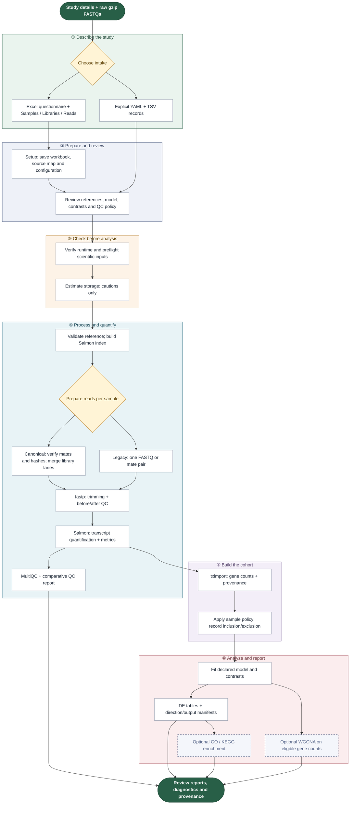

<div align="center">
  
  <h1>RNASeq pipeline · v2</h1>
  <p><strong>Your study design. Your reads. A traceable analysis.</strong></p>
  <p>Excel-driven intake · Snakemake execution · Locked Linux runtime</p>
  <a href="https://github.com/prem-p-singh/RNASeq-pipeline/releases/tag/v2.0.0">Release notes</a> ·
  <a href="#quick-start">Quick start</a> ·
  <a href="#how-the-workflow-runs">Workflow</a> ·
  <a href="INPUTS.md">Input guide</a> ·
  <a href="docs/RELEASE.md">Validation</a>
</div>

<p align="center">
  <a href="https://github.com/prem-p-singh/RNASeq-pipeline/actions/workflows/release-validation.yml"></a>
  <a href="https://github.com/prem-p-singh/RNASeq-pipeline/actions/workflows/checks.yml"></a>
  <a href="LICENSE"></a>
  
</p>

Turn **raw, non-UMI bulk RNA-seq FASTQs** into quality reports, gene counts and differential-expression results. Fill an Excel intake or provide explicit TSV/YAML inputs, review the study configuration, and run locally on Linux or through SLURM. Every project has its own configuration, logs and results.

> [!NOTE]
> **V2 is the current bulk RNA-seq release.** The wider multi-assay platform remains a roadmap. The workbook's **schema version 3** describes its file format; the software release is **v2.0.0**.

## What you can run

| Capability | V2 status | Boundary |
|---|---|---|
| Single-end and paired-end bulk RNA-seq | 🟢 **Tested** | Annotated, non-UMI raw FASTQ input |
| Multiple sequencing runs/lanes | 🟢 **Tested** | Merge within one compatible library per sample using canonical records |
| Independent groups and fixed-effect contrasts | 🟢 **Tested** | Estimable declared model and biological replication required |
| Excel intake | 🟢 **Tested** | Independent bulk designs, optional batch; external files or inline records |
| GO enrichment | 🔵 **Fixture-tested** | Compatible OrgDb and gene-ID mapping required |
| WGCNA | 🔵 **Fixture-tested** | Eligible cohort and expression; no large-cohort sizing guarantee |
| Random effects with `dream` | 🟡 **Provisional** | YAML configuration; full mixed-model qualification remains open |
| TAG-seq / 3′ end-tag | 🟡 **Provisional** | No named kit qualified; Excel execution blocked |
| KEGG enrichment | 🟠 **Conditional** | Network and organism mapping required; live results need separate qualification |

> [!WARNING]
> **Not implemented:** UMI processing; multiple prepared libraries per sample; small/viral RNA; single-cell/nucleus; spatial; long-read; dual-organism and specialized RNA assays; STAR counting, DESeq2/edgeR inference adapters; splicing/fusions/variants; generic count-matrix, processed-object or instrument-data imports.

Salmon is the implemented quantifier. The [recommendation rules](config/recommendation_rules.yaml) record this selection and reject unsupported choices. Dependence structure selects limma-voom or provisional dream. Sample count does not silently change the model. PCA may flag a batch association, but it does **not** add model terms automatically.

## How the workflow runs

Each coloured band is one of the six stages described below the map; dashed boxes are optional analyses.



| | Stage | What happens |
|:-:|---|---|
| **①** | **Describe the study** | Samples identify biological observations; libraries describe preparation; reads identify each file, mate, run and lane. Lanes do not become biological replicates. |
| **②** | **Prepare and review** | Excel setup saves the original workbook and cell-level source map. Automatic reference lookup needs network access; review the exact reference before launching. |
| **③** | **Check before analysis** | The launcher verifies software, validates metadata/design and records recommendations. Unsupported scientific inputs stop here. Low/unknown storage generates a caution and execution continues. |
| **④** | **Process and quantify** | Canonical inputs undergo FASTQ/mate/checksum checks and within-library merging. fastp cleans reads, then Salmon quantifies transcripts. Local source FASTQs are preserved. |
| **⑤** | **Build the cohort** | tximport produces bulk gene counts using `lengthScaledTPM`. Effective lengths and count provenance are saved. The configured QC exclusion policy determines retained samples. |
| **⑥** | **Analyze and report** | Fit the declared model, record contrast directions and produce requested optional results. Empty, skipped, unavailable and failed are distinct outcomes. |

> [!NOTE]
> The diagram reflects the current DAG: QC reporting follows quantification; WGCNA currently waits for DE completion although it uses gene counts. Independent raw-QC execution and broader assay-specific processing remain future work.

## Quick start

**[Get v2](#1-get-v2-and-choose-paths) → [Install](#2-install-and-verify-the-environment) → [Fill the intake](#3-fill-the-excel-intake) → [Review](#4-review-the-study-configuration) → [Run](#5-plan-run-and-resume)**

### 1. Get v2 and choose paths

```bash
git clone --branch v2.0.0 https://github.com/prem-p-singh/RNASeq-pipeline.git
cd RNASeq-pipeline
export REPO="$(pwd)"
export PROJECT="$HOME/rnaseq_projects/my_study"
```

Private repositories require GitHub authentication. Keep projects **outside the source checkout**. For SLURM, choose absolute shared paths visible on every worker for the repository, project, environment, reads and reference cache.

### 2. Install and verify the environment

Prerequisites: **Linux x86_64**, Bash, Conda, Git, `curl`, `gzip` and `flock`; internet access for initial installation and remote references. Supply Conda yourself or load your site's Conda module. macOS, ARM and containers are not qualified deployment targets for v2.

```bash
# Choose a shared path when using SLURM.
export RNASEQ_ENV_PREFIX="$HOME/rnaseq_runtime/v2"
# Optional: place Conda downloads on a suitable filesystem.
# export CONDA_PKGS_DIRS=/absolute/path/conda-packages

prefix=$(bash "$REPO/scripts/bootstrap.sh")
source "$(conda info --base)/etc/profile.d/conda.sh"
conda activate "$prefix"
export PYTHONNOUSERSITE=1 R_ENVIRON_USER=/dev/null R_PROFILE_USER=/dev/null
export R_LIBS_USER="$prefix/lib/R/library" R_LIBS_SITE="$prefix/lib/R/library"
```

Bootstrap installs the **579 exact package builds** in the [Linux lock](environments/linux-64.explicit.txt), checks installed package records, imports required Python/R libraries and verifies tool versions and locations. Missing packages are downloaded during environment creation. A mismatched existing environment is refused; create a fresh prefix. Normal launches repeat verification. Bootstrap does not install Conda or operating-system packages. Project annotation packages belong outside the qualified runtime.

Core versions: Python 3.12.14 · Snakemake 9.19.0 · R 4.5.2 · Salmon 1.10.3 · fastp 0.23.4. See [the runtime contract](docs/RELEASE.md#runtime-contract). `environment.yml` is a maintainer solve specification; use the explicit lock for installation.

### 3. Fill the Excel intake

Copy [intake_template.xlsx](intake_template.xlsx) and fill **Bulk RNA-seq**. Enter literal answers, not formulas. Select raw FASTQ, confirm **UMI = no**, and supply organism, layout, strand expectation, biological question, primary factor and smallest biological group size. Choose enrichment/WGCNA settings explicitly.

| Record source | What to fill |
|---|---|
| **workbook tables** | Fill Samples, Libraries and Reads from row 5; clear external metadata-file and FASTQ-folder answers |
| **external files** | Provide metadata CSV/TSV/XLSX and FASTQ folder; leave record tabs empty; one file/pair per sample |

- **Samples:** one row per biological observation, unique `sample_id`, biological-unit identity and model covariates. Add or rename covariate columns to match your primary factor and batch.
- **Libraries:** one library per sample; supply `library_id`, `sample_id`, `assay_family=bulk`, `layout`, `strandedness` and `umi=no`. Kit/platform fields record context, not automatic protocol-specific processing.
- **Reads:** one gzip FASTQ per row, with read/library IDs, role and URI. Identify each run/lane. Paired units need R1 and R2. Byte size and SHA256 are optional checks.

Format identifiers as **Text before entry**, including `001` or `NA`. Append rows beyond the preformatted area as needed. Relative workbook paths resolve beside the workbook. Copy the intake and reads to the analysis host before setup. External-file mode matches FASTQ filenames to sample IDs; explicit read records do not rely on filenames.

```bash
python3 "$REPO/scripts/setup.py" \
  --intake /absolute/path/completed_intake.xlsx \
  --project-dir "$PROJECT"
```

Fill Project name on exactly one assay tab, or add `--intake-sheet 'Bulk RNA-seq'`. Setup refuses to overwrite an existing project configuration. [INPUTS.md](INPUTS.md) covers workbook compatibility and canonical TSV/YAML contracts. Repeated measures and `use_existing` OrgDb package selection require explicit YAML configuration.

<details>
<summary><strong>Alternative: start directly from YAML and TSV templates</strong></summary>

```bash
mkdir -p "$PROJECT/config"
cp "$REPO/config/config.template.yaml" "$PROJECT/config/config.yaml"
cp "$REPO/config/thresholds.yaml" "$PROJECT/config/thresholds.yaml"
cp "$REPO/config/samples.tsv.template" "$PROJECT/config/samples.tsv"
```

These are examples, not study-specific defaults. Replace organism, references, assay/layout, sample records, model, contrasts, QC policy and optional analyses. Use `rnaseq_single` or `rnaseq_paired` for bulk. Replace the example interaction/random-effect model with your own design.

For canonical input, populate the three [metadata templates](templates/) under `$PROJECT/metadata` and set:

```yaml
samples:
  seq_type: rnaseq_paired
  metadata_dir: metadata
  sheet: metadata/samples.tsv
```

Relative canonical TSV read paths resolve beside those tables. Legacy `config/samples.tsv` has one file/pair per row. YAML-assisted setup is also available via [setup_inputs.template.yaml](scripts/setup_inputs.template.yaml):

```bash
python3 "$REPO/scripts/setup.py" --project-dir "$PROJECT" /absolute/path/setup_inputs.yaml
```

</details>

### 4. Review the study configuration

Inspect `$PROJECT/config/config.yaml`, the selected sample sheet and `config/thresholds.yaml` before launch:

| Setting | Confirm |
|---|---|
| Reference | Correct organism/release, matching transcriptome FASTA/GTF, versioned URLs and gene identifiers |
| Layout and strand | Correct mates and protocol; unknown strand is not assumed reverse |
| Model and contrasts | Biological units, covariates and intended comparisons; inspect resolved directions afterward |
| Sample policy | Whether failing-QC samples may be excluded; experiment-appropriate thresholds |
| Optional analyses | GO/KEGG/WGCNA choices, annotation package, `orgdb.key_type` and mapping |
| Paths and retention | Output/cache locations, worker access and `hpc.delete_fastq_after_quant` |

The default index is transcriptome-only; it is decoy-aware only when compatible decoys are explicitly supplied. Use immutable references: changed remote content at an unchanged URL is not automatically detected. Bulk counts already carry length correction; do not apply it again downstream. Review live reference lookups before analysis.

### 5. Plan, run and resume

**SLURM:** configure account, partition and QoS in the selected [profile](profiles/) for your site. No cluster name/account is hard-coded. The controller must be allowed to submit jobs; scientific rules execute on workers.

```bash
# Planning needs an activated Python/R runtime; it does not install one.
bash "$REPO/submit.sh" -d "$PROJECT" --plan-only
# Verify/bootstrap runtime and inspect the DAG.
bash "$REPO/submit.sh" -d "$PROJECT" --dry-run
# Launch; repeat to resume after fixing failures.
bash "$REPO/submit.sh" -d "$PROJECT" -p small
```

Profiles `small`, `medium` and `large` set scheduler concurrency. Default profile selection considers sample count; profile limits, library count and `hpc.samples_in_flight` determine concurrent jobs. Storage never reduces concurrency. Snakemake options follow `--`, for example `-- --forcerun differential_expression`.

**Local Linux or a single worker allocation:** activate the verified environment, then run each command in order. Fix preflight errors before launching Snakemake.

```bash
cd "$PROJECT"
python3 "$REPO/scripts/preflight.py" -d "$PROJECT"
python3 "$REPO/scripts/plan_resources.py" -d "$PROJECT" --out gates/resource_plan.json
snakemake --snakefile "$REPO/Snakefile" --configfile config/config.yaml \
  --config repo_dir="$REPO" --cores 4 --scheduler greedy --rerun-incomplete
```

Repeat the Snakemake command to resume. Dry-run DAG construction can update resolved configuration and invalidate stale bookkeeping without running scientific rules.

### Storage and cleanup

> [!IMPORTANT]
> There is **no 20 GB limit**. Estimates use measurable input sizes, all library lanes, retained outputs/intermediates, reference/runtime costs and concurrent working space. More libraries increase retained storage; fixed concurrency can keep peak temporary storage similar. Unknown remote sizes and expansion coefficients remain labelled estimates.

Low/unknown capacity is a **caution only**; it does not block launch or change the route. Actual failed writes still fail the affected task: restore capacity and resume. Legacy `hpc.storage_budget_gb` supplies advisory quota information. Local source FASTQs are preserved. When `hpc.delete_fastq_after_quant` is enabled, successful cleanup removes workflow-owned downloads, merged reads and trims; failed work keeps intermediates for diagnosis.

## Find and interpret results

`project.output_dir` controls the result root. Manual templates default to `results/`; Excel setup normally uses `results/<project_name>/`.

| Location | Contents |
|---|---|
| `intake/<workbook-hash>/` | Original workbook, cell source map and normalized setup inputs |
| `metadata/` or `config/samples.tsv` | Sample/library/read records |
| `gates/` | Preflight, recommendations, resolved settings, resource plan and decisions; launcher runtime verification |
| `<output>/quant/<sample>/` | `quant.sf`, fastp reports, input hashes and metrics; canonical `read_preparation.json` with lane inputs and fragment counts |
| `<output>/qc_report/` | Comparative HTML/PNG/TSV and MultiQC |
| `<output>/counts.tsv`, `gene_lengths.tsv`, `gene_import.rds` | Retained-cohort counts, effective lengths and tximport object |
| `<output>/counts_provenance.json`, `sample_disposition.tsv` | Count semantics and inclusion/exclusion reasons |
| `<output>/DE_Results/`, `de_manifest.tsv` | Contrast-specific results and direction definitions |
| `<output>/GO_results/`, `KEGG_results/`, `enrichment_status.tsv` | Enrichment outputs and explicit outcomes |
| `<output>/WGCNA/`, `wgcna_manifest.tsv` | Network outputs or skip status |
| `metrics/`, `logs/` | Stage summaries and diagnostic logs |
| Reference directory/cache | Index and `reference.lock.json` with source checksums |

> [!TIP]
> Start with QC, sample disposition and `DE_Results/contrast_directions.tsv`. Interpret positive logFC using its recorded numerator/denominator. Review library-type disagreements. Workflow completion may include optional analyses marked skipped or unavailable; inspect their manifests.

Preserve the project, original inputs, reference identity, runtime lock and exact source version. Local input, configuration and runtime-lock changes participate in rerun decisions. Missing tracked report/provenance outputs are regenerated. Remote content changes require explicit refresh.

## Troubleshooting

| Symptom | Action |
|---|---|
| Workbook import error | Check the reported cell; use literal answers, unique text IDs and one selected assay tab |
| Conflicting sources | Choose external files or workbook tables; clear unused records/paths |
| Missing mate/duplicate read | Correct library/run/lane/role assignments; never downgrade paired input |
| Unsupported assay/UMI | V2 cannot execute that route; use an appropriate external workflow |
| Non-estimable design | Resolve missing covariates, confounding or inadequate biological replication |
| Reference ID mismatch | Supply matching FASTA/GTF releases and inspect reference logs |
| Runtime mismatch | Read the verifier report and create a fresh locked prefix |
| SLURM submission failure | Configure site resources and verify worker-visible paths |
| Space caution/disk-full | Review the estimate, restore capacity or choose another filesystem; resume |
| Optional output absent | Inspect enrichment/WGCNA statuses and annotation prerequisites |

> [!CAUTION]
> For an issue, include the commit/tag, command, relevant configuration, preflight findings and failing rule log. Remove credentials and private participant metadata before sharing.

## Validation and development

```bash
python3 scripts/environment_check.py --out environment_report.json
bash tests/run_all.sh --strict   # any missing dependency/skip fails qualification
bash tests/check_public.sh      # separate networked six-sample public smoke test
```

The strict suite has **22 checks** for input contracts, read preparation, reference/cache safety, count agreement, DE directions, declared-model preservation, enrichment, WGCNA, storage and recovery. Scientific CI installs the lock and also runs the public smoke test. [Release qualification](docs/RELEASE.md) separates current source evidence from historical environment/SLURM checks. Synthetic tests and a downsampled public study do not establish validity for every organism or design.

For clean installation on a SLURM worker, run `sbatch scripts/validate_slurm.sbatch` with your site's scheduler options. Developer mode (`bash tests/run_all.sh`) permits reported dependency skips; it is not the release gate. See [v2 changes](CHANGELOG.md), [input contracts](INPUTS.md), [design](DESIGN.md) and [limitations](docs/RELEASE.md).

<details>
<summary><strong>Optional remote setup helper</strong></summary>

```bash
export RNASEQ_SSH_HOST=your_ssh_alias
export RNASEQ_REMOTE_REPO=/absolute/shared/path/RNASeq-pipeline
bash scripts/start_new.sh my_study /path/to/metadata.tsv
```

The remote checkout defaults to `RNASeq_pipeline` under the remote home directory if unset. No host is selected automatically. The wizard expects `~/new_project_inbox/PROJECT_NAME`. This uploader/wizard and n8n are convenience integrations, not equivalent to the qualified core workflow.

</details>

## License and citation

Source is [MIT licensed](LICENSE). External tools, annotations and datasets retain their licenses. The handbook PDF and private planning/evidence files are not redistributed. Use [CITATION.cff](CITATION.cff); record **v2.0.0**, references and tool versions in your methods.

Maintained by **Prem Pratap Singh**, Department of Viticulture and Enology, University of California, Davis.
