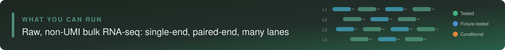
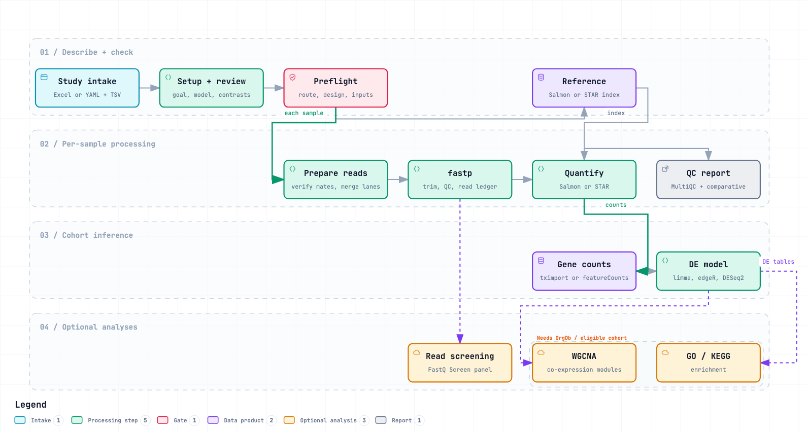

<div align="center">
  
  <h1>RNASeq pipeline · v2.1.1</h1>
  <p><strong>Your study design. Your reads. A traceable analysis.</strong></p>
  <p>Excel-driven intake · Snakemake execution · Locked Linux runtime</p>
  <a href="https://github.com/prem-p-singh/RNASeq-pipeline/releases/tag/v2.1.1">Release notes</a> ·
  <a href="#quick-start">Quick start</a> ·
  <a href="#how-the-workflow-runs">Workflow</a> ·
  <a href="INPUTS.md">Input guide</a> ·
  <a href="docs/RELEASE.md">Validation</a>
</div>

<p align="center"></p>

<p align="center">
  <a href="https://github.com/prem-p-singh/RNASeq-pipeline/actions/workflows/release-validation.yml"></a>
  <a href="https://github.com/prem-p-singh/RNASeq-pipeline/actions/workflows/checks.yml"></a>
  <a href="LICENSE"></a>
  
</p>

Turn **raw, non-UMI bulk RNA-seq FASTQs** into quality reports, gene counts and differential-expression results. Fill an Excel intake or provide explicit TSV/YAML inputs, review the study configuration, and run locally on Linux or through SLURM. Every project has its own configuration, logs and results.

> [!NOTE]
> **v2.1.1 is the current release.** It covers bulk RNA-seq. Other assay types are in progress; see [Future scope](#future-scope).

## What you can run



| Capability | Status | Notes |
|---|---|---|
| Single-end and paired-end bulk RNA-seq | 🟢 **Tested** | Annotated organism, raw FASTQ input, libraries without UMIs |
| Multiple sequencing runs and lanes | 🟢 **Tested** | Merged within one library per sample |
| Excel intake | 🟢 **Tested** | Analysis goal, paired or repeated subjects, formula and contrasts; records in the workbook or in external files |
| Quantification with Salmon | 🟢 **Tested** | Genome decoys by default for new projects |
| Alignment with STAR and featureCounts | 🟢 **Tested** | Needs a genome, a GTF and a declared strand |
| Differential expression: limma-voom, edgeR QL, DESeq2 | 🟢 **Tested** | Fixed-effect designs with biological replication |
| QC-only and expression-only runs | 🟢 **Tested** | No statistical design needed |
| Paired and repeated measures | 🔵 **Fixture-tested** | Fixed subject block, or a random subject effect with `dream` |
| Read screening for contamination | 🔵 **Fixture-tested** | Diagnostic only; it never removes reads or samples |
| GO enrichment | 🔵 **Fixture-tested** | Needs a compatible OrgDb and gene-ID mapping |
| WGCNA | 🔵 **Fixture-tested** | Needs an eligible cohort; not sized for very large cohorts |
| KEGG enrichment | 🟠 **Conditional** | Needs network access and organism mapping |

**Tested** means the route passed synthetic checks and a six-sample public study. **Fixture-tested** means it passed synthetic checks only.

You choose the quantifier and the DE method in the workbook or the configuration; the [recommendation rules](config/recommendation_rules.yaml) record the choice and reject unsupported ones. Sample count never changes the model silently. PCA may flag a batch association, but it does **not** add model terms.

## How the workflow runs


<p align="center"><picture><source media="(prefers-color-scheme: dark)" srcset="assets/workflow-2.1-dark.png" /></picture></p>

| | Stage | What happens |
|:-:|---|---|
| **①** | **Describe the study** | Samples identify biological observations; libraries describe preparation; reads identify each file, mate, run and lane. Lanes do not become biological replicates. |
| **②** | **Prepare and review** | Excel setup saves the original workbook and cell-level source map. Automatic reference lookup needs network access; review the exact reference before launching. |
| **③** | **Check before analysis** | The launcher verifies software, validates metadata/design and records recommendations. Unsupported scientific inputs stop here. Low/unknown storage generates a caution and execution continues. |
| **④** | **Process and quantify** | Reads pass FASTQ, mate and checksum checks and lanes are merged within a library. fastp cleans reads; Salmon quantifies transcripts, or STAR aligns to the genome. Optional screening reports possible contamination. Local source FASTQs are preserved. |
| **⑤** | **Build the cohort** | Gene counts come from tximport (`lengthScaledTPM`) for Salmon or from featureCounts for STAR. Lengths and count provenance are saved. The configured QC exclusion policy determines retained samples. |
| **⑥** | **Analyze and report** | Fit the declared model, record contrast directions and produce requested optional results. Empty, skipped, unavailable and failed are distinct outcomes. |

## Quick start


**[Get v2](#1-get-v2-and-choose-paths) → [Install](#2-install-and-verify-the-environment) → [Fill the intake](#3-fill-the-excel-intake) → [Review](#4-review-the-study-configuration) → [Run](#5-plan-run-and-resume)**

<p align="center"></p>

<a id="1-get-v2-and-choose-paths"></a>


```bash
git clone --branch v2.1.1 https://github.com/prem-p-singh/RNASeq-pipeline.git
cd RNASeq-pipeline
export REPO="$(pwd)"
export PROJECT="$HOME/rnaseq_projects/my_study"
```

Private repositories require GitHub authentication. Keep projects **outside the source checkout**. For SLURM, choose absolute shared paths visible on every worker for the repository, project, environment, reads and reference cache.

<a id="2-install-and-verify-the-environment"></a>


Prerequisites: **Linux x86_64**, Bash, Conda, Git, `curl`, `gzip` and `flock`; internet access for initial installation and remote references. Supply Conda yourself or load your site's Conda module. macOS and ARM are not supported. A stock Ubuntu container passed installation and the Salmon route, but no container image is shipped; see [release qualification](docs/RELEASE.md#what-was-tested).

```bash
# Choose a shared path when using SLURM.
export RNASEQ_ENV_PREFIX="$HOME/rnaseq_runtime/v2"
# Optional: place Conda downloads on a suitable filesystem.
# export CONDA_PKGS_DIRS=/absolute/path/conda-packages

prefix=$(bash "$REPO/scripts/bootstrap.sh")
source "$(conda info --base)/etc/profile.d/conda.sh"
conda activate "$prefix"
export PYTHONNOUSERSITE=1 R_ENVIRON_USER=/dev/null R_PROFILE_USER=/dev/null
export R_LIBS_USER="$prefix/lib/R/library" R_LIBS_SITE="$prefix/lib/R/library"
```

Bootstrap installs the **580 exact package builds** in the [Linux lock](environments/linux-64.explicit.txt), checks installed package records, imports required Python/R libraries and verifies tool versions and locations. Missing packages are downloaded during environment creation. A mismatched existing environment is refused; create a fresh prefix. Normal launches repeat verification. Bootstrap does not install Conda or operating-system packages. Project annotation packages belong outside the qualified runtime.

Core versions: Python 3.12.14 · Snakemake 9.19.0 · R 4.5.2 · Salmon 1.10.3 · fastp 0.23.4. See [the runtime list](docs/RELEASE.md#runtime). `environment.yml` is a maintainer solve specification; use the explicit lock for installation.

<a id="3-fill-the-excel-intake"></a>


Copy [intake_template.xlsx](intake_template.xlsx) and fill **Bulk RNA-seq**. Enter literal answers, not formulas. Select raw FASTQ, confirm **UMI = no**, and supply the analysis goal, organism, layout, strand expectation, biological question, primary factor and smallest biological group size. For paired or repeated measures, name the subject column. Choose enrichment/WGCNA settings explicitly.

| Record source | What to fill |
|---|---|
| **workbook tables** | Fill Samples, Libraries and Reads from row 5; clear external metadata-file and FASTQ-folder answers |
| **external files** | Provide metadata CSV/TSV/XLSX and FASTQ folder; leave record tabs empty; one file/pair per sample |

- **Samples:** one row per biological observation, unique `sample_id`, biological-unit identity and model covariates. Add or rename covariate columns to match your primary factor and batch.
- **Libraries:** one library per sample; supply `library_id`, `sample_id`, `assay_family=bulk`, `layout`, `strandedness` and `umi=no`. A named library protocol (TruSeq, NEBNext) sets adapters and strand, and the platform sets poly-G trimming.
- **Reads:** one gzip FASTQ per row, with read/library IDs, role and URI. Identify each run/lane. Paired units need R1 and R2. Byte size and SHA256 are optional checks.

Format identifiers as **Text before entry**, including `001` or `NA`. Append rows beyond the preformatted area as needed. Relative workbook paths resolve beside the workbook. Copy the intake and reads to the analysis host before setup. External-file mode matches FASTQ filenames to sample IDs; explicit read records do not rely on filenames.

```bash
python3 "$REPO/scripts/setup.py" \
  --intake /absolute/path/completed_intake.xlsx \
  --project-dir "$PROJECT"
```

Fill Project name on exactly one assay tab, or add `--intake-sheet 'Bulk RNA-seq'`. Setup refuses to overwrite an existing project configuration. [INPUTS.md](INPUTS.md) covers workbook compatibility and canonical TSV/YAML contracts. Selecting an already installed OrgDb package (`use_existing`) requires explicit YAML configuration.

<details>
<summary><strong>Alternative: start directly from YAML and TSV templates</strong></summary>

```bash
mkdir -p "$PROJECT/config"
cp "$REPO/config/config.template.yaml" "$PROJECT/config/config.yaml"
cp "$REPO/config/thresholds.yaml" "$PROJECT/config/thresholds.yaml"
cp "$REPO/config/samples.tsv.template" "$PROJECT/config/samples.tsv"
```

These are examples, not study-specific defaults. Replace organism, references, assay/layout, sample records, model, contrasts, QC policy and optional analyses. Use `rnaseq_single` or `rnaseq_paired` for bulk. Replace the example interaction/random-effect model with your own design.

To use the Samples, Libraries and Reads tables, fill in the three [metadata templates](templates/) under `$PROJECT/metadata` and set:

```yaml
samples:
  seq_type: rnaseq_paired
  metadata_dir: metadata
  sheet: metadata/samples.tsv
```

Relative read paths in those tables resolve beside them. The simpler `config/samples.tsv` has one file or pair per row. YAML-assisted setup is also available via [setup_inputs.template.yaml](scripts/setup_inputs.template.yaml):

```bash
python3 "$REPO/scripts/setup.py" --project-dir "$PROJECT" /absolute/path/setup_inputs.yaml
```

</details>

<a id="4-review-the-study-configuration"></a>


Inspect `$PROJECT/config/config.yaml`, the selected sample sheet and `config/thresholds.yaml` before launch:

| Setting | Confirm |
|---|---|
| Reference | Correct organism/release, matching transcriptome FASTA/GTF, versioned URLs and gene identifiers |
| Layout and strand | Correct mates and protocol; unknown strand is not assumed reverse, and STAR needs it declared |
| Quantifier and DE method | Salmon or STAR; limma-voom, edgeR QL or DESeq2 (see [options](docs/OPTIONS.md)) |
| Model and contrasts | Biological units, covariates and intended comparisons; inspect resolved directions afterward |
| Sample policy | Whether failing-QC samples may be excluded; experiment-appropriate thresholds |
| Optional analyses | GO/KEGG/WGCNA choices, annotation package, `orgdb.key_type` and mapping |
| Paths and retention | Output/cache locations, worker access and `hpc.delete_fastq_after_quant` |

New projects build the Salmon index with genome decoys; set `reference.decoys: null` for a transcriptome-only index. Use immutable references: changed remote content at an unchanged URL is not automatically detected. Bulk counts already carry length correction; do not apply it again downstream. Review live reference lookups before analysis.

<a id="5-plan-run-and-resume"></a>


**SLURM:** configure account, partition and QoS in the selected [profile](profiles/) for your site. No cluster name/account is hard-coded. The controller must be allowed to submit jobs; scientific rules execute on workers.

```bash
# Planning needs an activated Python/R runtime; it does not install one.
bash "$REPO/submit.sh" -d "$PROJECT" --plan-only
# Verify/bootstrap runtime and inspect the DAG.
bash "$REPO/submit.sh" -d "$PROJECT" --dry-run
# Launch; repeat to resume after fixing failures.
bash "$REPO/submit.sh" -d "$PROJECT" -p small
```

You can also launch straight from the workbook, without a separate setup step:

```bash
bash "$REPO/submit.sh" --intake /path/study.xlsx -d "$PROJECT" --executor slurm
```

If the workbook changes later, the launcher lists the changed settings and the stages they affect, then stops; add `--accept-revision` to apply the change.

Profiles `small`, `medium` and `large` set scheduler concurrency. Default profile selection considers sample count; profile limits, library count and `hpc.samples_in_flight` determine concurrent jobs. Storage never reduces concurrency. Snakemake options follow `--`, for example `-- --forcerun differential_expression`.

**Local Linux or a single worker allocation:** activate the verified environment, then run each command in order. Fix preflight errors before launching Snakemake.

```bash
cd "$PROJECT"
python3 "$REPO/scripts/preflight.py" -d "$PROJECT"
python3 "$REPO/scripts/plan_resources.py" -d "$PROJECT" --out gates/resource_plan.json
snakemake --snakefile "$REPO/Snakefile" --configfile config/config.yaml \
  --config repo_dir="$REPO" --cores 4 --scheduler greedy --rerun-incomplete
```

Repeat the Snakemake command to resume. Dry-run DAG construction can update resolved configuration and invalidate stale bookkeeping without running scientific rules.

### Storage and cleanup

Before launch, the workflow estimates the disk space the project needs from the size of your reads, the reference and the number of jobs running at once. If space looks short or cannot be measured, you get a **warning only**: the run still starts and nothing is slowed down. A write that really fails stops that step; free some space and relaunch to resume.

Your original FASTQ files are never deleted. With `hpc.delete_fastq_after_quant` enabled, the workflow removes its own downloads, merged reads and trimmed reads after a sample finishes successfully, and keeps them when a step fails so you can inspect it.

## Find and interpret results


`project.output_dir` controls the result root. Manual templates default to `results/`; Excel setup normally uses `results/<project_name>/`.

| Location | Contents |
|---|---|
| `intake/<workbook-hash>/` | Original workbook, cell source map and normalized setup inputs |
| `metadata/` or `config/samples.tsv` | Sample/library/read records |
| `gates/` | Preflight, recommendations, resolved settings, resource plan and decisions; launcher runtime verification |
| `<output>/quant/<sample>/` | `quant.sf` (Salmon) or indexed BAM and gene counts (STAR), fastp reports, input hashes and metrics; `read_preparation.json` with lane inputs and fragment counts |
| `<output>/qc_report/` | Comparative HTML/PNG/TSV and MultiQC |
| `<output>/counts.tsv`, `gene_lengths.tsv`, `gene_import.rds` | Retained-cohort counts, effective lengths and tximport object |
| `<output>/counts_provenance.json`, `sample_disposition.tsv` | Count semantics and inclusion/exclusion reasons |
| `<output>/DE_Results/`, `de_manifest.tsv` | Contrast-specific results and direction definitions |
| `<output>/GO_results/`, `KEGG_results/`, `enrichment_status.tsv` | Enrichment outputs and explicit outcomes |
| `<output>/WGCNA/`, `wgcna_manifest.tsv` | Network outputs or skip status |
| `metrics/`, `logs/` | Stage summaries and diagnostic logs |
| Reference directory/cache | Index and `reference.lock.json` with source checksums |

> [!TIP]
> Start with QC, sample disposition and `DE_Results/contrast_directions.tsv`. Interpret positive logFC using its recorded numerator/denominator. Review library-type disagreements. Workflow completion may include optional analyses marked skipped or unavailable; inspect their manifests.

Preserve the project, original inputs, reference identity, runtime lock and exact source version. Local input, configuration and runtime-lock changes participate in rerun decisions. Missing tracked report/provenance outputs are regenerated. Remote content changes require explicit refresh.

## Troubleshooting


| Symptom | Action |
|---|---|
| Workbook import error | Check the reported cell; use literal answers, unique text IDs and one selected assay tab |
| Conflicting sources | Choose external files or workbook tables; clear unused records/paths |
| Missing mate/duplicate read | Correct library/run/lane/role assignments; never downgrade paired input |
| Unsupported assay/UMI | This release cannot run that route; see [Future scope](#future-scope) |
| Non-estimable design | Resolve missing covariates, confounding or inadequate biological replication |
| Reference ID mismatch | Supply matching FASTA/GTF releases and inspect reference logs |
| Runtime mismatch | Read the verifier report and create a fresh locked prefix |
| SLURM submission failure | Configure site resources and verify worker-visible paths |
| Space caution/disk-full | Review the estimate, restore capacity or choose another filesystem; resume |
| Optional output absent | Inspect enrichment/WGCNA statuses and annotation prerequisites |

> [!CAUTION]
> For an issue, include the commit/tag, command, relevant configuration, preflight findings and failing rule log. Remove credentials and private participant metadata before sharing.

## Options

| You want | Set |
|---|---|
| QC only, or counts without statistics | Analysis goal in the workbook, or `analysis.objectives: [qc]` / `[gene_expression]` |
| Genome alignments and BAM files | `analysis.quantifier: star`, with a genome, a GTF and a declared strand |
| A specific DE method | `analysis.backend: limma_voom`, `edger_ql` or `deseq2` |
| Paired or repeated measures | Subject column in the workbook |
| Custom comparisons | Contrasts tab in the workbook, or `contrasts` in the configuration |
| A contamination check | Screening answer in the workbook, or a `screening` block |
| Read quality before any analysis | `python3 "$REPO/scripts/raw_qc.py" -d "$PROJECT" --out "$PROJECT/raw_qc_run1"` |

New projects default to DESeq2 for 3 to 12 biological units in the smallest group and limma-voom above 12; two units per group needs an explicit choice. [docs/OPTIONS.md](docs/OPTIONS.md) explains each option.

## Validation


Every release must pass **35 checks with none skipped**, plus a six-sample public study run through both Salmon and STAR. v2.1.1 passed on a SLURM cluster and in the [hosted workflow](https://github.com/prem-p-singh/RNASeq-pipeline/actions/workflows/release-validation.yml). To repeat it in an installed environment:

```bash
star_prefix=$(bash scripts/bootstrap.sh --module star)
screen_prefix=$(bash scripts/bootstrap.sh --module screen)
export PATH="$CONDA_PREFIX/bin:$star_prefix/bin:$screen_prefix/bin:$PATH"
bash tests/run_all.sh --strict
bash tests/check_public.sh --screen
bash tests/check_public.sh --star
```

These checks use synthetic data and one downsampled public study, so they do not prove correctness for every organism or design. Job records and known limits are in [docs/RELEASE.md](docs/RELEASE.md); changes are in the [changelog](CHANGELOG.md).

<details>
<summary><strong>Optional remote setup helper</strong></summary>

```bash
export RNASEQ_SSH_HOST=your_ssh_alias
export RNASEQ_REMOTE_REPO=/absolute/shared/path/RNASeq-pipeline
bash scripts/start_new.sh my_study /path/to/metadata.tsv
```

The remote checkout defaults to `RNASeq_pipeline` under the remote home directory if unset. No host is selected automatically. The wizard expects `~/new_project_inbox/PROJECT_NAME`. This uploader/wizard is a convenience integration, not equivalent to the qualified core workflow.

</details>

## Future scope

Work under way for later releases:

- **3′ end-tag libraries** (Lexogen QuantSeq FWD, REV and FWD-UMI), including UMI counting
- **Small RNA** for animals and plants
- **Host and pathogen in the same libraries** (dual-organism analysis)

Planned after that: single-cell and single-nucleus, spatial, long-read and specialized RNA assays.

Until those are released, this workflow handles bulk libraries without UMIs, with one library per sample. Splicing, fusion and variant analysis, and import of ready-made count matrices, are outside its scope.

## License and citation


Source is [MIT licensed](LICENSE). External tools, annotations and datasets retain their licenses. The handbook PDF and private planning/evidence files are not redistributed. Use [CITATION.cff](CITATION.cff); record **v2.1.1**, references and tool versions in your methods.

Maintained by **Prem Pratap Singh**, Department of Plant Pathology, University of California, Davis.
