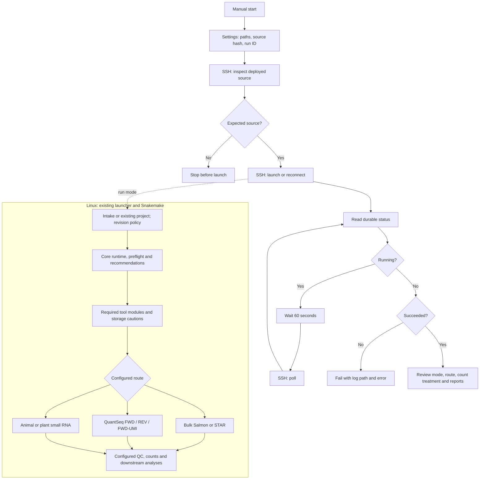

# n8n integration for the 2.1 candidate and 3.0 development pipeline

This workflow controls the implemented pipeline in `claude/release-3.0`, reviewed at commit **5936319a355f12f1418c3117ae8bc5a8c29b2e10**. That branch contains the 2.1 bulk upgrades and the newer QuantSeq and small-RNA routes. These are development/candidate identifiers, not a claim that both releases have been published or that the entire multi-assay roadmap is complete.

The older integration targeted `01190c1` and missed the other branch. This version requires an explicit `pipeline_repo` and a matching source fingerprint before launch. Its default fingerprint matches the reviewed release-3.0 source, not the older parent checkout where these integration files were created.

## Included files and deployment

- **`rnaseq.workflow.json`** — portable n8n workflow, importable into n8n 2.25.7.
- **`rnaseq.openssh.workflow.json`** — alternative for an n8n host with an existing OpenSSH alias/agent.
- **`runner.py`** — durable SSH bridge using Python's standard library.
- **`request.example.json`** — host-side configuration; copy it outside the checkout.
- **`source.review.json`** — reviewed source identity and coverage.
- **`tests/check_n8n.py`** — isolated bridge lifecycle checks.
- **`tests/check_n8n_release.py`** — real Linux launcher/DAG integration tests.

A combined source archive is prepared locally at `dist/RNASeq-3.0-n8n-integration.tar.gz`. It contains the release-3.0 source, the recorded bootstrap PATH correction, and this integration; it is not a new public release. Extract it to a dedicated Linux directory such as `/srv/rnaseq/RNASeq_pipeline-3.0`. Alternatively, copy `integrations/n8n/` into a checkout of the reviewed commit and apply `patches/bootstrap-path.patch` from that checkout with `git apply`. The patch forces module verification to use that module's executables even when STAR already precedes Conda on PATH. No branch switch or merge into another task's working tree is required.

## Coverage of the upgrades

| Implemented capability | Integration behavior |
|---|---|
| Schema 7 Excel, including the 2.1 schema-5 upgrades; older compatible workbooks | `intake` and `intake_sheet` feed the existing importer. Recognized execution tabs are `Bulk RNA-seq`, `TAGseq`, and `sRNA-seq`. |
| Advanced bulk study design | Preserves objectives, subject effects, fixed formulas, contrasts, kit/platform choices and handbook-backed defaults resolved by setup. n8n does not substitute its own model. |
| Workbook revisions | Defaults to report/refuse. After reviewing the impact, set `accept_revision: true` with a new run ID to pass `--accept-revision`; the launcher retains previous configuration. This can change configuration even in dry-run mode. |
| Named bulk kits and platform preprocessing | Uses the current kit policy, adapters, strand and poly-G settings. |
| Screening panels built from FASTA | Existing DAG builds the configured panel; diagnostic screening remains non-destructive. |
| Bulk Salmon | Transcript quantification, reference/decoy validation, gene-level import and downstream objectives. |
| Bulk STAR/featureCounts | Genomic alignments, indexed BAMs and raw gene counts, with the locked STAR module. |
| QuantSeq FWD and REV | Kit-specific preprocessing and stranded STAR/featureCounts routing. |
| QuantSeq FWD-UMI | Kit-specific UMI/spacer extraction and umi_tools gene-molecule counting; uses STAR and UMI modules. Generic UMI support is not implied. |
| Animal small RNA | Configured mature-miRNA reference, Bowtie unique-hit counting and size-selection reporting. |
| Plant small RNA | Genome-based ShortStack joint loci and DicerCall outputs. Both small-RNA routes use the srna module. |
| Independent raw QC | `mode: raw_qc` invokes the existing observation-only canonical bulk command. Requires an existing project, local execution on an appropriate analysis host/allocation, and no intake revision. Outputs go into the new attempt directory. |
| QC/count-only/DE/coexpression | Uses the existing conditional DAG and its validation rules. |
| limma-voom, edgeR, DESeq2, dream | Delegates supported designs and qualification boundaries to pipeline preflight. |
| GO/KEGG/WGCNA | Preserves configured optional analyses and explicit skipped/unavailable outcomes. |
| Storage | Dataset-dependent caution only; actual write failures and invalid inputs still fail. |
| Restart and provenance | Request snapshot, source fingerprint, atomic status, logs, project lock, and `--rerun-incomplete`. |

Read `config/tagseq_kits.yaml` and `config/small_rna_kits.yaml` in the deployed source for the exact qualified kit list. The reviewed branch marks QuantSeq FWD/REV/FWD-UMI and TruSeq Small RNA validated against its recorded fixtures. This integration does not independently expand that scientific qualification.

**Still outside implemented scope:** generic UMI libraries, other unqualified kits, single-cell/nucleus, spatial, long-read, dual-organism and specialized assay routes. n8n does not add missing scientific implementations or bypass preflight. The local macOS `stats` environment does not replace the locked Linux runtime.

## Workflow diagram



Dry-run mode constructs the configured DAG without executing scientific rules. `raw_qc` is a separate observation-only command. The diagram summarizes stages; Snakemake schedules independent rules concurrently when their inputs are ready.

## Using an existing SSH alias

For a native/self-hosted n8n instance that already has **Execute Command** enabled, import `rnaseq.openssh.workflow.json` and set `sshHost` in Settings to your existing SSH alias. The node invokes `/usr/bin/ssh -o BatchMode=yes -o ConnectTimeout=15`; it uses the n8n operating-system user's SSH configuration, host keys and agent. No private key is embedded in the workflow or copied into n8n credentials. Normal host-key checks stay enabled.

The configured installation on this Mac uses `ssh farm` and reconnects to the completed bulk-STAR dry run. This is a local installation choice; the portable file defaults to `analysis-host`. This transport needs no n8n SSH credential. It cannot work in n8n Cloud or a container without access to the appropriate SSH setup. If Execute Command is disabled by your administrator, use the credential-based workflow instead; this integration does not automatically enable it or change instance security settings.

Both transports use the same source validation, runner and status logic. A status-only demo verifies the connection without submitting new work. Change to study-specific paths and an appropriate executor before starting an analysis.

## Setup sequence

1. **Deploy the correct source.** Use the combined archive or reviewed checkout on Linux x86_64. The host needs Python 3.9+, Bash, Conda and the normal pipeline prerequisites. Keep the source unchanged during runs. Check its identity:

   ```bash
   python3 /srv/rnaseq/RNASeq_pipeline-3.0/integrations/n8n/runner.py inspect \
     --repo /srv/rnaseq/RNASeq_pipeline-3.0
   ```

   The expected source hash is `c0927cf7f31e0fc603c39eec9b432f9efcdcbbc53971d422dfe1ba2b2de6750c`. It hashes source/configuration/runtime-lock inputs, independent of Git metadata. If you intentionally deploy reviewed changes later, inspect them first, then update the request and n8n Settings hashes together. Do not blindly copy a mismatching hash to bypass the check.

2. **Prepare host inputs.** Put the completed workbook, FASTQs and reference sources on host-visible storage. Copy `request.example.json` to a project-specific location outside the repository. Set `pipeline_repo`, `project`, `conda_bin`, and intake paths. `conda_bin` contains the `conda` executable. The optional environment prefixes select core, STAR, screen, srna and UMI installations; unused modules are not installed. Omit intake fields for an existing reviewed YAML project.
3. **Choose compute.** Use `executor: local` on a dedicated Linux analysis machine or a live worker allocation. Use `executor: slurm` on a site-approved persistent controller host and configure its SLURM profiles. `cores` controls local CPU allocation; per-rule resources control SLURM jobs. Detached processes must be allowed to survive SSH logout. Do not execute local analysis on a cluster login node. Site-specific module setup must be available in the SSH execution environment; the bridge supplies a Conda executable path, not a site-specific module command.
4. **Import into n8n.** Import `rnaseq.workflow.json`. It is manual and inactive, with no webhook, automatic schedule, or embedded credentials. The original workflow can remain as a historical copy; use the new **RNASeq 2.1 + 3.0** workflow.
5. **Configure SSH (credential-based variant only).** Select the same analysis-host SSH Private Key credential on **Inspect deployed pipeline**, **Launch or reconnect**, and **Poll remote run**. An empty credential list prevents SSH execution. Enter credentials only in n8n, never into the exported workflow JSON or chat.
6. **Edit Settings.** Set the deployed `repo`, host-side `request`, matching `project`, and new `runId`. Keep `action='start'` for a new attempt. Paths are on the SSH host, not the Mac or n8n container. Project identity is checked before any launch. The runner also checks the source hash independently.
7. **Check first.** Keep request `mode: dry_run`. Execute and inspect configuration, recommendations, preflight issues, storage cautions and the controller log. Dry-run preparation can install packages, import intake, and update bookkeeping. It is not a read-only operation or a successful scientific analysis.
8. **Analyze.** After reviewing the study, change request `mode` to `run`, use a **new** run ID, and execute again. For a changed workbook, leave `accept_revision` false to obtain its impact/refusal first. Set it true only when you intend to apply that revision, using another new ID.

For independent raw QC, use an existing canonical bulk project, omit `intake`/`intake_sheet`, set `mode: raw_qc`, `executor: local`, and at most 16 cores. No reference or DE design is required by that separate command. Every attempt creates a new raw-QC output directory.

## Status and outputs

Each attempt writes `<project>/.n8n/runs/<run_id>/request.json`, `status.json`, and `controller.log`. State is `running`, `succeeded`, `failed`, or `interrupted`. The final item includes the deployed source identity, actual recommendation/route/count treatment, preflight stages and resource report when produced in this attempt. Older gate files are not relabeled as current evidence. Raw QC exposes its own report path.

Scientific artifacts remain under the project's configured output directory. Review preprocessing/QC, gene counts and count provenance, sample inclusion/exclusion, DE directions and optional-analysis manifests. Small-RNA/QuantSeq outputs retain the pipeline's route-specific semantics; read counts and UMI molecule counts are not interchangeable. Successful completion can include optional stages marked skipped or unavailable.

```bash
python3 /srv/rnaseq/RNASeq_pipeline-3.0/integrations/n8n/runner.py status \
  --project /srv/rnaseq/projects/my_study --run-id my-study-analysis-001
```

## Recovery and operational limits

- Same ID plus the same request reconnects without relaunching; changed requests require a new ID. Set n8n `action='status'` to reconnect without validating/installing an analysis environment. Source mismatch does not prevent status-only reconnection.
- To resume a failed scientific run, correct the problem, ensure no old controller/orphan jobs remain, then use a new ID with `action='start'`. The launcher receives `--rerun-incomplete`. Workbook revision handling remains explicit.
- A per-project POSIX lock rejects concurrent bridge controllers. Different projects can run independently. Direct manual launcher calls bypass the bridge lock; do not mix them concurrently for one project. The filesystem must support advisory locks.
- Stopping n8n stops monitoring, **not remote computation**. On SLURM, worker jobs can outlive the controller. Use normal host/scheduler cancellation procedures and inspect orphan jobs before retrying. The integration never automatically deletes results, unlocks Snakemake or kills jobs.
- Default monitoring ceiling is seven days; increase Settings `maxHours` and n8n execution time limits if appropriate. Reconnect to a timed-out monitor with the same run ID.
- A source fingerprint is checked before launch and immediately before the child executes. It does not freeze a filesystem: do not edit the checkout during execution. Preserve original data and reference identity using pipeline provenance.

## Validation

See `VALIDATION.md` for current measured integration results and remaining deployment requirements. Scientific qualification recorded by the release branch is separate from n8n orchestration testing.

References: [n8n SSH node](https://docs.n8n.io/integrations/builtin/core-nodes/n8n-nodes-base.ssh/), [Wait node](https://docs.n8n.io/integrations/builtin/core-nodes/n8n-nodes-base.wait/), [import/export](https://docs.n8n.io/workflows/export-import/).

## Integration gate and parent boundary

This checkout remains workbook **schema 4**. Tracking the orchestration files does
not backport workbook revisions, TAG-seq/QuantSeq, or small-RNA implementations.
The deployed source is the separate schema-7 commit recorded in
`source.review.json`, plus its recorded patch.

`bash tests/run_all.sh` in this parent gate checkout now dispatches all three n8n
checks. To run only this gate:

```bash
bash tests/run_all.sh --n8n
bash tests/run_all.sh --n8n --strict
```

The combined bundle retains the reviewed source's own `run_all.sh`; run the
commands above from this parent gate checkout with `RNASEQ_N8N_SOURCE` pointing
to the extracted bundle. The three individual n8n test scripts are also included
in the bundle.

The node check needs Node.js; the isolated bridge check needs Python 3.9+, Bash
and POSIX file locks. The release smoke needs a Linux x86_64 worker allocation,
PyYAML, `CONDA_EXE`, and installed locked environments at `RNASEQ_ENV_PREFIX`,
`RNASEQ_STAR_ENV_PREFIX`, `RNASEQ_SCREEN_ENV_PREFIX`, `RNASEQ_SRNA_ENV_PREFIX`, and
`RNASEQ_UMI_ENV_PREFIX`. Set `RNASEQ_N8N_SOURCE` to an extracted reviewed combined
bundle (not this parent). The gate verifies its schema and scientific fingerprint;
bootstrap validates its locked runtimes. Missing prerequisites exit 77 and are
reported as SKIP; strict mode fails on any skip. Once prerequisites are available, a supplied source that fails the
identity check is a failure. The smoke executes synthetic animal small-RNA and
QuantSeq UMI analyses as well as route dry runs, so run it only on an allocated
worker. Generated smoke output is retained in the printed temporary directory.
For an explicit persistent output path, invoke:

```bash
python3 tests/check_n8n_release.py --gate --repo "$RNASEQ_N8N_SOURCE" --out /path/to/new-output
```

The scientific fingerprint excludes `integrations/` and tests. It attests neither
the bridge nor its workflows; review their Git change and test results separately.
The combined archive also has its own SHA256 for transport integrity.
